# GitHub Helper Bots

## Overview

Topcoder has several types of challenges where participants should assign themselves to GitHub issues and or update issue labels:
- "Bug Bash Challenge"
- "Bug Hunt Challenge"
- "Bug Verification Challenge" (new)

To let participants assign issues and labels in the repositories we should grant participants `write` permission. But on GitHub `write` permission not only give access to the issues but also gives access for creating new branches, pushing to existent branches and so on.

To overcome such limitation of the GitHub permission system we can use bots, which would assign participants to issues and add labels for them without granting them `write` permission to the repository. These bots may also enforce various challenge rules. The bot itself has very limited access to the repositories, so it's very safe to use it:

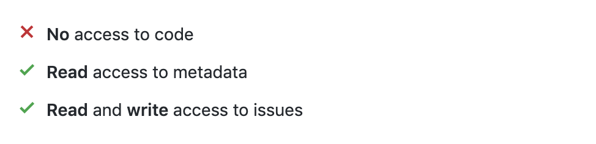

For example, we have "Bug Bash Challenge" where we have some set of issues that are marked as `Open for Pickup`. Any participant may assign such an issue, fix it, create a PR and mark issues as `Ready for Review`. Using bot users may assign them issues without `write` permission:

<details><summary>🎥 View demo video</summary>

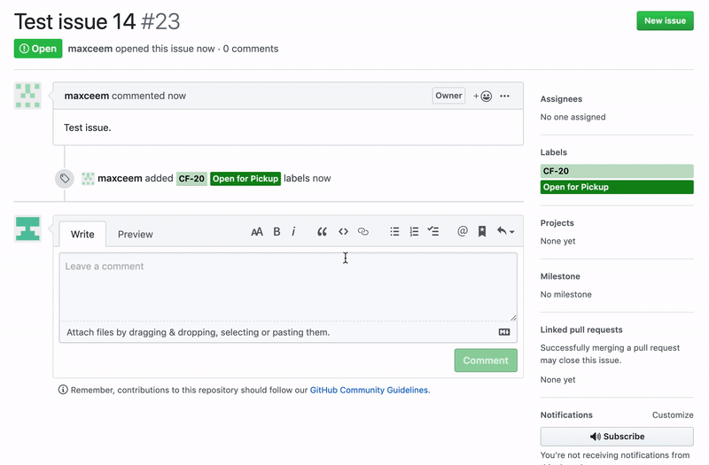

</details><br>

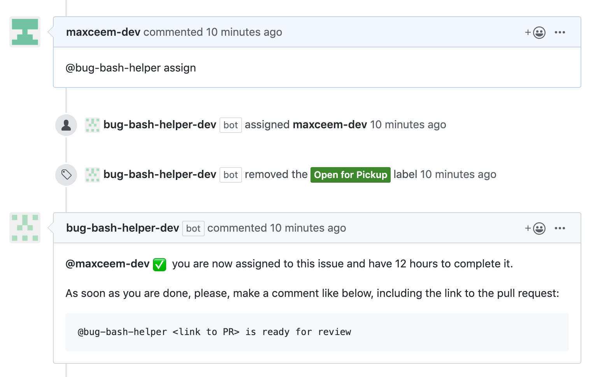

The bot can also enforce rules, for example working only on one issue at a time:

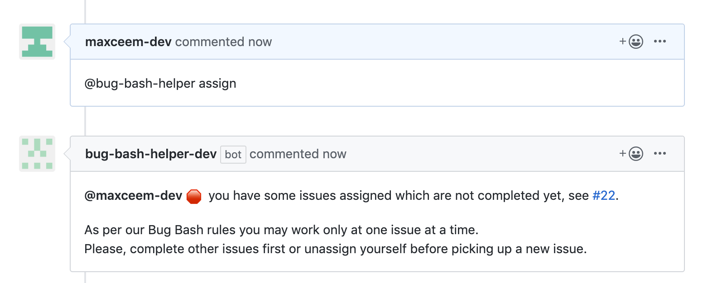

## How it works?

1. We install **GitHub App** to any repo we want to enable our bots.

2. **GitHub App** is listening to a limited set of events related to issues triggers a Webhook URL which points to our **NodeJs App (bot)**.
   The full list of events which we listen at the moment:

   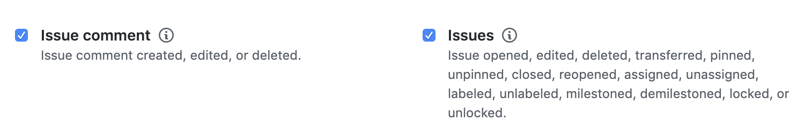

3. **NodeJs App (bot)** is the code which is stored in this repository, and here is where the actual work happens:

   - **GitHub App** is calling it using Webhook URL
   - **NodeJs App** checks if comment/issue mention any of the supported bots and if so, extracts the command to perform
   - for every command **NodeJs App** determines if such a command is allowed by calling **GitHub API** to get the current **up to date** situation. If all good, **NodeJs App** uses **GitHub API** to perform actions with the repository like assign/unassign users, add/remove labels and to post a reply comment from the bot.

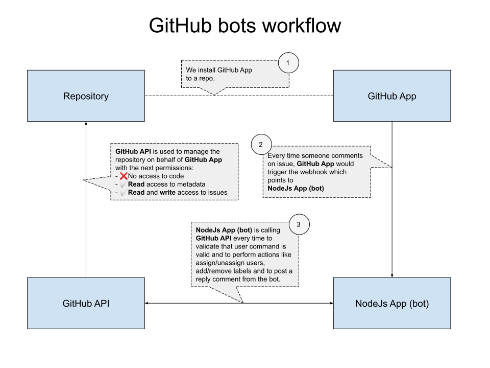

## Setup

To run the bot we should do 3 things:
1. Create a GitHub app.
2. Run the bot code locally or on the server.
3. Make sure that the GitHub app created on the first step points the URL of the app run on the second step.

There is an automatic way of creating the GitHub App fully configured for the bot. Please, follow the next steps locally whether you want to create a GitHub App for production or for local testing.

1. Clone the repo.

2. Make sure there is no `.env` file in the root folder (otherwise it means that some GitHub App is already configured). Run the bot app using the next commands:

    ```sh
    # Install dependencies
    npm install

    # Run the bot
    npm start
    ```

    You should see the next text in the console after staring:
    ```
    Welcome to Probot! Go to http://localhost:3000 to get started.
    ```

3. Navigate to http://localhost:3000 and click **Register GitHub App** button:

   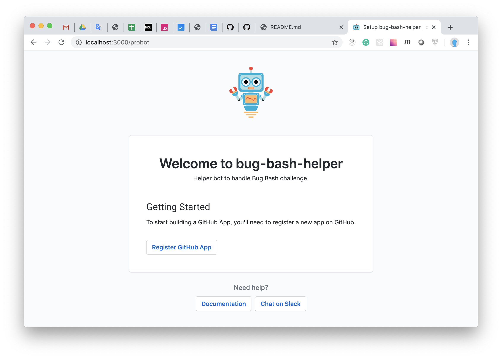

4. In the next form enter the GitHub App name, which should be unique for the whole GitHub  and click **Create GitHub App**:

   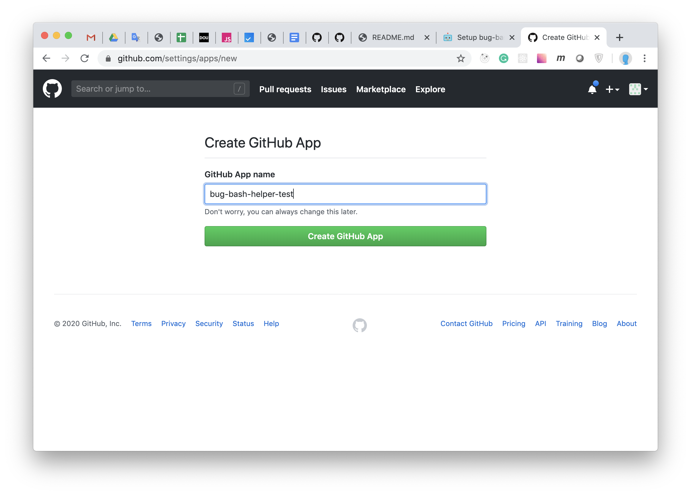

5. The GitHub App should be created. You can check that `.env` file is created in the root folder:

   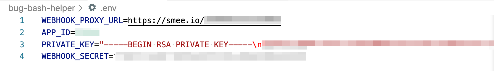

  At the same time in the browser, you would be redirected to the page for installing the GitHub App for some repo. This step is optional and you can do this later by following the "[Usage](#usage)" section below.

  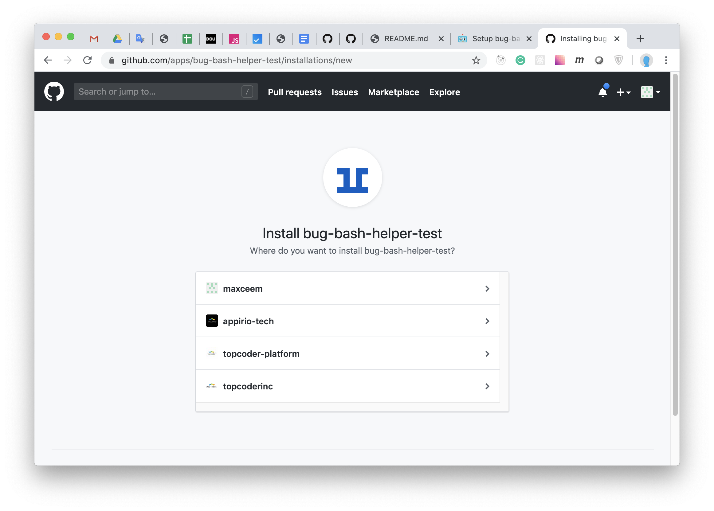

   For example, this is how it looks when I'm choosing my test repo to install the bot:

   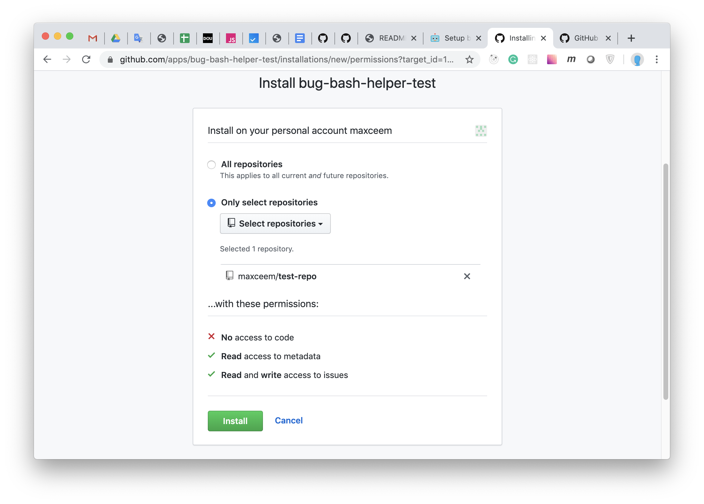

> The process above uses the automatic GitHub App creating process. You may do the same manually by following [Manually Configuring a GitHub App](https://probot.github.io/docs/development/#manually-configuring-a-github-app).

### Run Locally

By default, the created GitHub App points to the bot app which is run locally. Stop the bot and run it again by `npm start` so it pickups the config from `.env` file. Note, that created GitHub App would call the service run locally by calling https://smee.io URL which would forward the request to the local service.

### Run on the server

To run the bot on the remote server do the next steps:

   1. Deploy the bot code to the server.

   2. Make sure to set environment variables on the server: `APP_ID`, `PRIVATE_KEY`, `WEBHOOK_SECRET`. You may get them from `.env` file which has been generated during the GitHub App creating.

   3. Run the bot on the server by `npm start`

   4. Change the **Webhook URL** of the GitHub App:

      - Navigate to the GitHub App settings page by URL `https://github.com/settings/apps/<GitHub-App-Name>` (replace `<GitHub-App-Name>` with the actual GitHub App name).

      - Change **Webhook URL** to the URL of the deployed service.

## Configuration

When developing the app, you will need to have several different fields in a `.env` file which specifies environment variables. Here are some common use cases:

Variable | Description
---|---
`APP_ID` | The App ID assigned to your GitHub App. **Required** <p>_(Example: `1234`)_</p>
**Private key options** | One of the following is **Required** if there is no `.pem` file in your project's root directory
`PRIVATE_KEY_PATH` | The path to the `.pem` file for your GitHub App. <p>_(Example: `path/to/key.pem`)_</p>
`PRIVATE_KEY` | The contents of the private key for your GitHub App. If you're unable to use multiline environment variables, use base64 encoding to convert the key to a single line string. |
**Webhook options** |
`WEBHOOK_PROXY_URL` | Allows your local development environment to receive GitHub webhook events. Go to https://smee.io/new to get started. <p>_(Example: `https://smee.io/your-custom-url`)_</p>
`WEBHOOK_SECRET` | The webhook secret used when creating a GitHub App. 'development' is used as a default, but the value in `.env` needs to match the value configured in your App settings on GitHub. Note: GitHub marks this value as optional, but for optimal security, it's required for Probot apps. **Required** <p>_(Example: `development`)_</p>

Some less common environment variables you may find in the [Probot documentation](https://github.com/probot/probot/blob/master/docs/configuration.md).


## NPM Commands

| Command | Description |
|-|-|
| `npm run dev` | The dev script will start your app using [nodemon](https://github.com/remy/nodemon#nodemon), which will watch for any files changes in your local development environment and automatically restart the server. |
| `npm start` | Stash the app in production mode. |
| `npm run lint` | Lint the code using [Standard](https://standardjs.com/) linter with the automatic fix of the lint issues when possible |
| `npm run test` | Run unit tests. |
| `npm run test:watch` | Constantly watch files for changes and re-run unit tests on every change. |

## Usage

### Enable the bot for repository

To enable the bot for any repository we should install the bot to that repo.

Navigate to the page for managing installations for GitHub App: `https://github.com/settings/apps/<GitHub-App-Name>/installations/new` (replace `<GitHub-App-Name>` with the actual GitHub App name).

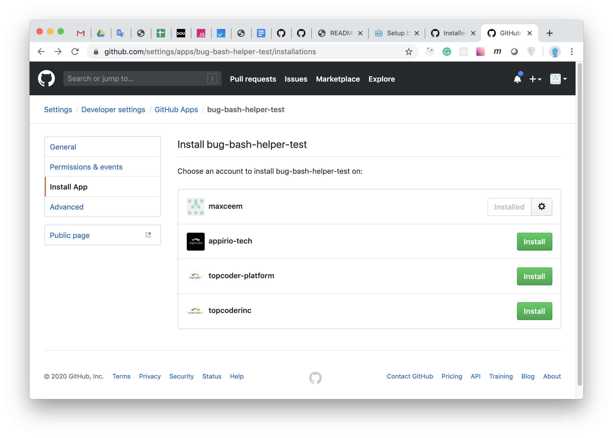

- Click **Install** button and follow the UI guidance to install the GitHub App (bot) to some repo.
- Or click the settings icon to change the configuration for some repo where the bot is already installed.

After enabling the bot, you may comment on any issue with bot command to check if it works.

### Supported bots

#### Bug Bash Helper

##### help

To get the list of supported commands make a comment:
```
@bug-bash-helper help
```

##### assign

To assign yourself to the issue make a comment:
```
@bug-bash-helper assign me
```

##### unassign

To unassign yourself from the issue make a comment:
```
@bug-bash-helper unassign me
```

##### ready for review

As soon as you are done, please, make a comment like below, including the link to the pull request:
```
@bug-bash-helper <link to PR> is ready for review
```

#### Bug Hunt Helper

##### help

To get the list of supported commands make a comment:
```
@bug-hunt-helper help
```

##### add label

To add label to the issue, add comment like below with comma-separated list of labels:
```
@bug-hunt-helper add label: Label Name 1, Label Name 2, Label Name 3
```

##### remove label

To remove label from the issue, add comment like below with comma-separated list of labels:
```
@bug-hunt-helper remove label: Label Name 1, Label Name 2, Label Name 3
```

#### Bug Verification Helper

##### help

To get the list of supported commands make a comment:
```
@bug-verification-helper help
```

##### assign

To assign yourself to the issue make a comment:
```
@bug-verification-helper assign me
```

##### unassign

To unassign yourself from the issue make a comment:
```
@bug-verification-helper unassign me
```

##### pass or fail

As soon as you are ready, add one of the comments bellow to mark this issue as passed or failed:
```
@bug-verification-helper mark as pass
```

or

```
@bug-verification-helper mark as fail
```

## Notes

- This GitHub App is built with [Probot](https://github.com/probot/probot). It has very good documentation, so if something is not covered with this README, you may check out the [Probot Documentation](https://probot.github.io/docs/).

## Roadmap

Here are some ideas for bot improvements:

- Make **Bug Bash Helper** compatible with **Topcoder X** so payments for the issues would be processed automatically during Bug Bash Challenge.

- Consider deploying the bot to Serverless service, see [Serverless deployment](https://probot.github.io/docs/serverless-deployment/).

- Cover code with unit tests.